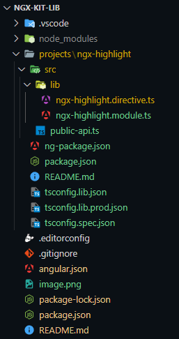
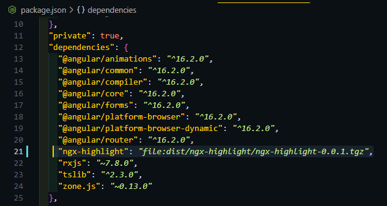

# NgxKitLib

This project was generated with [Angular CLI](https://github.com/angular/angular-cli) version 16.2.12.

## Development server

Run `ng serve` for a dev server. Navigate to `http://localhost:4200/`. The application will automatically reload if you change any of the source files.

## Angular Lib

Generar el proyecto:
```bash
ng new ngx-kit-lib --no-create-application
```

Ingresar a la carpeta del proyecto
```bash
cd ngx-kit-lib
```

Crear la librería:
```bash
ng g lib ngx-highlight
```

Borrar los archivos de la carpeta creada, solo dejar el module

Crear una directiva:
```bash
ng g directive ngx-highlight
```

Quedando el directorio de la siguiente manera:



Dejar la directiva en declarations y exports de NgxHighlightModule

```typescript
@NgModule({
  declarations: [NgxHighlightDirective],
  imports: [],
  exports: [NgxHighlightDirective],
})
```

### En el archivo public-api.ts pondemos lo que queremos exponer como librería:
Agregar la directiva como export:
```typescript
export * from './lib/ngx-highlight.directive';
```

Crear lo que se quiera en la directiva.
Construir el proyecto
```bash
ng build
```

### Crear una aplicación de prueba dentro del proyecto:
```bash
ng generate application demo
```

Entrar a la carpeta generada en /dist
```bash
cd .\dist\ngx-highlight\
```

Generar el package:
```bash
npm pack
```

Volver a la carpeta principal e instalar con la ruta del package, donde se creó el archivo anteriormente:
```bash
npm i D:\development\angular-lib\ngx-kit-lib\dist\ngx-highlight\ngx-highlight-0.0.1.tgz
```
Ahora se verá la libreria en las dependencias


### En el app.module de demo hacer el import del modulo de la librería (NgxHighlightModule)
Para utilizar la librería, se crea un elemento con texto en el app html de la demo y
se le pone la directiva creada: libNgxHighlight

```html
  <p libNgxHighlight>Este es un Ejemplo de una libreria con angular</p>
```

y ya se debería ver el funcionamiento.

### Si estamos editanto y probando la lib aún:
Corremos el sieguiente comando en la terminal:
```bash
ng build ngx-highlight --watch
```
y ya podremos ver el cambio e ir probando.


## Para publicar la lib en npm

- Posionarse en la carpeta dist/ngx-highlight
- Hacer login en npm: ```npm login```
- Luego ```npm publish``` para publicar la lib, si da error porque ya existe el nombre.
- *** _Para cambiar el nombre se edita el name del package.json de la lib (npx-highlight)._